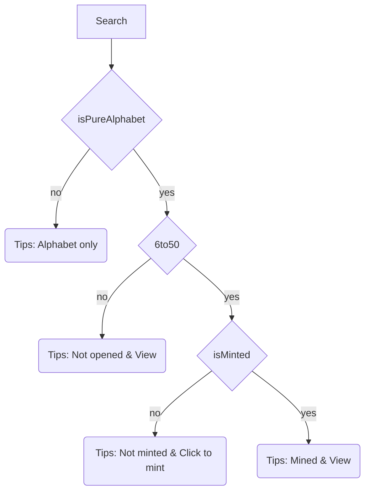

## 搜索流程

```mermaid
graph TD
A[Search] --> B{isPureAlphabet}
B --> |no| C(Tips: Alphabet only)
B --> |yes| D{6to50}
D --> |no| E(Tips: Not opened & View)
D --> |yes| F{isMinted} 
F --> |no| G(Tips: Not minted & Click to mint)
F --> |yes| H(Tips: Mined & View)
```

